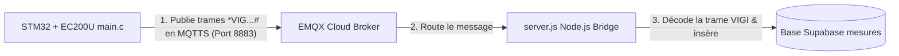

# Tunav Firmware - STM32F446RET6

Firmware embarqué pour une carte personnalisée basée sur le microcontrôleur **STM32F446RET6**. Le projet utilise **STM32Cube HAL**, **FreeRTOS** et **PlatformIO** sous **VS Code**. Il pilote un modem cellulaire **Quectel EC200U-EU**, fournit une console de diagnostic sur **USART2** et expose un comportement de télémétrie et de commande via **MQTT**.

## Vue d'ensemble

Le firmware est organisé autour de quatre fonctions principales :

1. allumer et faire clignoter une LED de diagnostic pour vérifier que le microcontrôleur démarre correctement ;
2. initialiser le modem EC200U-EU via UART4 et établir une connexion de données mobile ;
3. publier périodiquement un message MQTT de télémétrie ;
4. écouter des commandes MQTT entrantes et déclencher un redémarrage lorsque le mot `reset` est reçu.

Le code a été structuré pour rester compatible avec les sections `USER CODE BEGIN/END` générées par STM32Cube, ce qui facilite les évolutions futures sans casser la génération automatique.

## Matériel utilisé

### LED de diagnostic

- Broche : `PC13`
- Rôle : indique que la tâche principale est active
- Comportement : inversion d'état toutes les 500 ms

### Console série

- Interface : `USART2`
- Broches : `PA2` en TX, `PA3` en RX
- Configuration : `115200 bauds`, `8N1`
- Rôle : affichage des logs d'exécution, de démarrage et d'état réseau

### Modem cellulaire

- Interface : `UART4`
- Broches : `PA0` en TX, `PA1` en RX
- Configuration : `115200 bauds`, `8N1`
- Rôle : dialogue AT avec le modem Quectel EC200U-EU

## Architecture logicielle

### Fichiers applicatifs principaux

| Fichier | Rôle |
| --- | --- |
| [tunav/Src/main.c](tunav/Src/main.c) | Point d'entrée du firmware, configuration des périphériques, création des tâches FreeRTOS, logique MQTT et parsing UART4 |
| [tunav/Src/stm32f4xx_it.c](tunav/Src/stm32f4xx_it.c) | Gestion des interruptions Cortex-M et périphériques utilisés |
| [tunav/Src/stm32f4xx_hal_msp.c](tunav/Src/stm32f4xx_hal_msp.c) | Initialisation MSP des UART, des GPIO et des interruptions associées |
| [tunav/Src/stm32f4xx_hal_timebase_tim.c](tunav/Src/stm32f4xx_hal_timebase_tim.c) | Base de temps HAL basée sur TIM1 au lieu de SysTick |
| [tunav/Src/freertos.c](tunav/Src/freertos.c) | Fichier généré par CubeMX pour la partie FreeRTOS, ici très léger car les tâches sont définies dans `main.c` |
| [tunav/STM32CubeIDE/Application/User/syscalls.c](tunav/STM32CubeIDE/Application/User/syscalls.c) | Fonctions système minimales requises par newlib, notamment les entrées et sorties standard |
| [tunav/STM32CubeIDE/Application/User/sysmem.c](tunav/STM32CubeIDE/Application/User/sysmem.c) | Allocation mémoire de type `_sbrk()` pour `malloc()` et la pile newlib |
| [platformio.ini](platformio.ini) | Configuration PlatformIO : cible, upload ST-Link, vitesse de téléversement et chemins de compilation |
| [extra_script.py](extra_script.py) | Ajoute les flags FPU et compile les sources FreeRTOS du middleware |

Les dossiers [tunav/Drivers](tunav/Drivers) et [tunav/Middlewares](tunav/Middlewares) contiennent les bibliothèques STM32 et FreeRTOS fournies par ST. Ils sont généralement à laisser intacts, sauf besoin très spécifique.

### Déroulement au démarrage

Au démarrage, [tunav/Src/main.c](tunav/Src/main.c) exécute la séquence suivante :

1. `HAL_Init()` initialise le HAL.
- Séquence de boot : `HAL_Init()`, `SystemClock_Config()`, `MX_GPIO_Init()`, `MX_UART4_Init()` et `MX_USART2_UART_Init()`.
- L'UART4 démarre en réception interrompue pour alimenter le tampon circulaire.
- Les files FreeRTOS et la mutex GSM sont créées.
- Le noyau FreeRTOS est lancé, activant les tâches d'application.

## Architecture du Serveur (Node.js Bridge)

Le projet intègre un serveur local dans le dossier [server/](server/) qui fait le pont entre le broker EMQX MQTT et la base de données **Supabase** :



### Format des Trames de Mesures VIGI
Le firmware et le serveur d'intégration utilisent le protocole d'échange de trames suivant :
`*VIG&<imei>&D<ddMMyyyyhhmmss>&S<seuil_haut><seuil_bas>&V<voie1><voie2>...<voie7>&<status>#`

- **Date (`D...`)** : date et heure réseau au format ISO.
- **Seuils (`S...`)** : valeurs haut et bas encodées en hexadécimal 16 bits (multipliées par 10). Ex: `006C` correspond à `108` soit `10.8`.
- **Voies (7 canaux, `V...`)** : chaque voie fait 4 caractères hexadécimaux representant la valeur multipliée par 10.
- **Status** : concaténation de trois valeurs héxadécimales de 4 caractères : `DÉFAUTS`, `DÉPASSEMENTS`, `ALARMES` du système.

---

## Installation et Lancement Rapide (Étape par Étape)

### 1. Préparation de la Base de Données (Supabase)
Avant de lancer le serveur, vous devez avoir une table dans Supabase nommée `mesures` avec les colonnes suivantes :
- `id` (int8, Primary Key, autoincrement)
- `imei` (varchar)
- `timestamp` (timestamptz)
- `seuil_haut` (float4)
- `seuil_bas` (float4)
- `voie1`, `voie2`, `voie3`, `voie4`, `voie5`, `voie6`, `voie7` (float4 chacune)
- `defauts` (int4)
- `depassements` (int4)
- `alarmes` (int4)

### 2. Configuration et Lancement du Serveur de Décodage

1. Naviguez dans le dossier server :
   ```bash
   cd server
   ```
2. Installez les dépendances :
   ```bash
   npm install
   ```
3. Créez votre fichier d'environnement `.env` :
   Dupliquez le fichier `.env.example` et nommez-le `.env` :
   ```bash
   cp .env.example .env
   ```
4. Ouvrez le fichier `.env` nouvellement créé et configurez vos accès Supabase :
   ```env
   SUPABASE_URL=https://votre-id-projet.supabase.co
   SUPABASE_KEY=votre-cle-api-supabase
   ```
5. Lancez le serveur Node.js principal de production :
   ```bash
   npm start
   ```

Le terminal affichera que le serveur est en ligne, connecté au broker EMQX, et qu'il écoute le topic `tunav/telemetry` en attente de décoder des trames.

### 3. Simulation de Données (Optionnel, sans carte STM32)
Si vous voulez tester l'intégration et l'insertion en base Supabase (pour votre interface frontend Angular par exemple) sans allumer le STM32, vous pouvez lancer le simulateur indépendant :
```bash
npm run simulate
```

### 4. Téléversement et Déboguage du Firmware STM32
1. Compilez et chargez le code sur votre cible STM32F446RE via PlatformIO dans VS Code.
2. Assurez-vous d'appuyer sur le bouton **RESET** physique de votre carte après chaque téléversement.
3. Le STM32 va récupérer son IMEI via `AT+GSN`, l'heure réseau via `AT+CCLK?`, formater ses mesures simulées et les publier sur le topic. Le serveur capte et insère le tout en temps réel dans votre base.

---

## Tâches FreeRTOS

### `TaskLed`

Cette tâche fait clignoter la LED `PC13` toutes les 500 ms. Elle sert de témoin visuel pour confirmer que le système tourne correctement.

### `TaskMqtt`

Cette tâche gère la liaison de publication MQTT. Son rôle est le suivant :


- vérifier et préparer la connectivité du modem ;
- configurer le contexte de données avec l'APN `internet.tn` ;
- activer le contexte réseau ;
- ouvrir une session MQTT sur **EMQX Cloud** ;
- publier toutes les 5 secondes un message de télémétrie sur le topic `tunav/telemetry`.

Si la publication échoue, la tâche considère la liaison comme perdue et recommence la séquence d'initialisation.

### `Tasklog`

Cette tâche consomme la file de logs et les réécrit sur `USART2`. C'est elle qui rend les messages lisibles dans le moniteur série PlatformIO.

### `TaskPriorityMqt`

Cette tâche a une priorité plus élevée et s'occupe de la réception des commandes MQTT :

- elle attend d'abord quelques secondes au démarrage pour laisser la connexion réseau se stabiliser ;
- elle ouvre une seconde session MQTT sur le même broker ;
- elle s'abonne au topic `tunav/commands` ;
- elle lit en continu le tampon circulaire alimenté par l'interruption UART4 ;
- lorsqu'une ligne `+QMTRECV:` contient `reset` ou `RESET`, elle libère proprement la mutex puis redémarre le microcontrôleur avec `NVIC_SystemReset()`.

## Flux de communication

### Tampon circulaire UART4

La réception du modem passe par interruption. Chaque octet reçu est stocké dans un tampon circulaire. Ce choix évite de bloquer le microcontrôleur pendant l'attente des réponses AT et permet à plusieurs tâches d'exploiter les données reçues.

### Protection par mutex

L'accès au modem est protégé par `GsmMutex`. Une seule tâche peut donc parler au modem à la fois. Cette règle évite que les commandes AT de publication et les commandes AT de souscription se mélangent.

### File de logs

Les messages internes sont d'abord placés dans une file FreeRTOS. La tâche `Tasklog` les transmet ensuite sur `USART2`. Ce découplage évite de bloquer la logique métier avec les opérations série.

## Configuration PlatformIO

Le projet est compilé avec PlatformIO à partir du fichier [platformio.ini](platformio.ini).

Points importants :

- la cible PlatformIO est basée sur `nucleo_f446re` pour réutiliser la chaîne d'outils STM32F446RE ;
- le téléversement se fait via `stlink` ;
- la vitesse de téléversement est volontairement basse pour fiabiliser la connexion sur la carte ;
- les options `connect_assert_srst` et `srst_only` améliorent la reprise de connexion sur certaines cartes plus sensibles.

Le script [extra_script.py](extra_script.py) ajoute aussi les flags nécessaires au port FreeRTOS ARM_CM4F et inclut les sources du middleware FreeRTOS dans la compilation.

## Téléversement et démarrage

### Avec VS Code / PlatformIO

1. Ouvrez le projet dans VS Code.
2. Vérifiez que l'extension PlatformIO IDE est installée.
3. Lancez la commande de compilation ou le bouton **Upload**.
4. **Après chaque téléversement, appuyez sur le bouton RESET de la carte pour lancer réellement le firmware.**
5. Ouvrez ensuite le moniteur série à `115200 bauds` pour voir les logs.

### Avec le terminal PlatformIO

```bash
pio run
pio run -t upload
pio device monitor
```

Si la carte ne répond pas du premier coup, gardez le bouton **RESET** appuyé pendant le lancement du téléversement, puis relâchez-le au moment où la connexion au ST-Link est établie.

## Commandes et paramètres réseau utilisés

### Paramètres modem

- APN : `internet.tn`
- Port MQTT : `8883` (MQTTS)
- Broker : `jfaa7c61.ala.eu-central-1.emqxsl.com`

### Topics MQTT

- Publication : `tunav/telemetry`
- Réception : `tunav/commands`

### Séquence AT principale

Le firmware utilise principalement les commandes AT suivantes :

- `AT` pour tester la présence du modem ;
- `AT+CPIN?` pour vérifier la SIM ;
- `AT+QICSGP=1,1,"internet.tn","","",0` pour configurer le contexte de données ;
- `AT+QIACT=1` pour activer la connexion data ;
- `AT+QMTCFG="version",0,4` et `AT+QMTCFG="session",0,1` pour préparer la session MQTT ;
- `AT+QMTOPEN` et `AT+QMTCONN` pour ouvrir et connecter les liens MQTT ;
- `AT+QMTPUB` pour publier la télémétrie ;
- `AT+QMTSUB` pour s'abonner aux commandes.

## Notes importantes pour la maintenance

- Le code métier custom doit rester dans les sections `USER CODE BEGIN/END` pour préserver la compatibilité avec STM32Cube.
- La logique de reboot sur commande `reset` est gérée dans `TaskPriorityMqt`.
- `MqttCommandQueue` est créé dans le code et reçoit les lignes MQTT entrantes, mais le traitement applicatif de cette file peut encore être étendu selon les besoins du projet.
- Les fichiers `syscalls.c` et `sysmem.c` sont nécessaires pour un environnement newlib propre sur STM32.

## Résumé fonctionnel

En pratique, ce firmware sert de base de communication entre la carte STM32, un modem cellulaire et un broker MQTT. Il vérifie que le microcontrôleur démarre correctement, publie de la télémétrie périodique et accepte des commandes distantes. La procédure d'exploitation la plus importante est simple : **après chaque téléversement, appuyez sur RESET pour démarrer le programme**.

## EMQX Cloud Broker Setup

This section describes the configuration of the backend MQTT broker instance hosted on EMQX Cloud.

### Deployment & Host Information
- **Provider:** EMQX Cloud (Serverless Tier)
- **Region:** `eu-central-1` (Frankfurt)
- **Broker Host:** `jfaa7c61.ala.eu-central-1.emqxsl.com`

### Dashboard Configuration Steps

1.  **Authentication & Users:**
    - Navigate to **Access Control** -> **Authentication**.
    - Ensure a user exists with **Username:** `Tunav` and **Password:** `chebli`.
    - *Note: These credentials are used by both the STM32 firmware and the MQTTX testing environment.*

2.  **Network Ports:**
    - The deployment automatically exposes two secure endpoints:
        - **Port 8883 (MQTTS):** TCP with TLS, used by the STM32 EC200U cellular engine.
        - **Port 8084 (WSS):** WebSockets with TLS, used by MQTTX Web and other browser tools.

3.  **Topic Management:**
    - EMQX initializes topics **on-demand**.
    - You **do not** need to manually create or register `tunav/telemetry` or `tunav/commands` in the dashboard. They are created automatically when a client first publishes or subscribes to them.

## Cloud Testing Setup

This guide provides a step-by-step procedure for testing the firmware's MQTT functionality using the **MQTTX Web Client**.

### Important Requirements
- **Protocol Difference:** Since testing is done from a web browser, you **must** use the **Secure WebSocket (wss://)** protocol on port **8084**. Note that the STM32 firmware itself uses native **MQTTS** on port **8883**.
- **Unique Client ID:** Ensure your browser's Client ID is unique (e.g., `MQTTX_WEB_BROWSER_VAL`). Using the same ID as another device or the STM32 will cause connection conflicts and kick devices offline.

### Configuration Parameters
Use these exact settings in your MQTTX Web Connection:

| Parameter | Value |
| :--- | :--- |
| **Name** | EMQX Cloud Test |
| **Protocol** | `wss://` |
| **Host** | `jfaa7c61.ala.eu-central-1.emqxsl.com` |
| **Port** | `8084` |
| **Client ID** | `MQTTX_WEB_BROWSER_VAL` |
| **Path** | `/mqtt` |
| **Username** | `Tunav` |
| **Password** | `chebli` |
| **SSL/TLS** | **ON** (Enabled) |
| **SSL Secure** | **OFF** (Disabled - allows testing without CA certificate uploads) |
**link** : https://mqttx.app/web-client

### Interacting with the Firmware

#### 1. Monitoring Telemetry (Subscribing)
To view live data coming from the STM32 hardware:
- Add a new subscription.
- **Topic:** `tunav/telemetry`
- **QoS:** `0`
- **Result:** You should see telemetry messages arriving every **5 seconds**.

#### 2. Remote Commands (Publishing)
To trigger actions on the hardware remotely:
- **Topic:** `tunav/commands`
- **QoS:** `0`
- **Payload Type:** Plain Text
- **Payload Content:** `reset`
- **Result:** Sending this will trigger the `NVIC_SystemReset()` routine on the STM32, handled by our high-priority FreeRTOS ring-buffer task.
